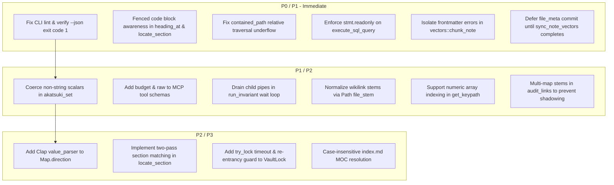

# Master Architectural Audit Report: Akatsuki v0.2.0 (Native Rust Rewrite)

**Generated**: 2026-09-21  
**Target Repository**: `fusuyfusuy/akatsuki` (v0.2.0 Native Rust Port)  
**Total Rust Substrate**: ~4,500 LOC across 11 modules  
**Review Engine**: Antigravity Boundary Review Protocol (4 Horizontal Scopes + 1 Cross-Boundary Seam Auditor)

---

## 1. Executive Scorecard

| Scope ID | Subsystem Name | Health Score | Status | Invariant Breaches | Critical Findings | Primary Driver |
| :--- | :--- | :---: | :---: | :---: | :---: | :--- |
| **`scope_1`** | **Storage & Markdown Engine** | **7.8 / 10** | `MODERATE` | 2 | 2 | CommonMark ATX & code fence blind spot in `locate_section`; relative path underflow in `contained_path`. |
| **`scope_2`** | **Index, Vectors & Graph** | **8.5 / 10** | `MINOR` | 2 | 0 | Dual-tx desync between `file_meta` & `note_vectors`; YAML error propagation aborting vector reconcile. |
| **`scope_3`** | **Domain Queries & Mutations** | **8.5 / 10** | `MINOR` | 0 | 1 | Mutating CTE bypass in read-only SQL validator; pipe buffer exhaustion risk on verbose invariants. |
| **`scope_4`** | **CLI & JSON-RPC MCP Daemon** | **8.6 / 10** | `MINOR` | 1 | 1 | `lint --json` & `verify --json` exit 0 on failure; non-string scalar dropout in `akatsuki_set`. |
| **`scope_seams`** | **Cross-Boundary Seams** | **9.4 / 10** | `MINOR` | 0 | 0 | Strong inter-module boundaries; airtight process group isolation and panic boundary containment. |
| **OVERALL** | **Full System Architecture** | **8.6 / 10** | **`MINOR`** | **5** | **4** | **Production-grade kernel with isolated edge and storage seams requiring targeted hardening.** |

---

## 2. Critical Findings & Invariant Breaches

### 🚨 IB-1: CLI `lint --json` and `verify --json` Return Exit Code 0 on Failure
- **Contract Violation**: [`SKILL.md#L84`](file:///home/devhax/projects/fusuyfusuy/akatsuki/SKILL.md#L84) defines `akatsuki lint ∧ akatsuki verify == exit 0` as the integrity gate, and [`SKILL.md#L205-L206`](file:///home/devhax/projects/fusuyfusuy/akatsuki/SKILL.md#L205-L206) specifies exit code `1` for schema lint errors and broken links.
- **Root Cause**: In [`src/cli/mod.rs#L531-L541`](file:///home/devhax/projects/fusuyfusuy/akatsuki/src/cli/mod.rs#L531-L541) (`Commands::Lint`) and [`src/cli/mod.rs#L545-L561`](file:///home/devhax/projects/fusuyfusuy/akatsuki/src/cli/mod.rs#L545-L561) (`Commands::Verify`), `std::process::exit(1)` is placed exclusively inside the `else` (non-JSON) branch. When `--json` is specified, both commands serialize the report and return `Ok(())`, exiting with code `0` even when `rep.passed == false`.
- **Impact**: Automated CI/CD pipelines running `akatsuki lint --json` falsely report success on corrupt or unlintable vaults.
- **Remediation**: Hoist `if !rep.passed { std::process::exit(1); }` outside the `if json { ... } else { ... }` block in both commands.

### 🚨 IB-2: Section Boundary Corruption via Comments Inside Code Blocks
- **Contract Violation**: [`.agents/memory.md#L17`](file:///home/devhax/projects/fusuyfusuy/akatsuki/.agents/memory.md#L17) establishes `storage::locate_section` as the single source of truth for heading lookups and section boundaries across readers and writers.
- **Root Cause**: [`heading_at` in src/storage/mod.rs#L447-L454`](file:///home/devhax/projects/fusuyfusuy/akatsuki/src/storage/mod.rs#L447-L454) parses any line starting with `#` as a heading without verifying trailing whitespace (CommonMark ATX violation) and without tracking markdown code fences (```` ``` ````). Any bash or python comment (e.g. `# setup trap`) inside a code block of level $\le$ target heading level matches as a heading, prematurely ending the section.
- **Impact**: Section extraction ([`src/storage/mod.rs#L490`](file:///home/devhax/projects/fusuyfusuy/akatsuki/src/storage/mod.rs#L490)), section replacement ([`src/mutations/mod.rs#L161`](file:///home/devhax/projects/fusuyfusuy/akatsuki/src/mutations/mod.rs#L161)), and invariant block extraction ([`src/index/mod.rs#L542`](file:///home/devhax/projects/fusuyfusuy/akatsuki/src/index/mod.rs#L542)) discard valid markdown and split content on internal code comments.
- **Remediation**: Require space or tab after `#` in `heading_at` (`c == ' ' || c == '\t'`) and track code block toggle state (`line.starts_with("```")`) in `locate_section`.

### 🚨 IB-3: Containment Escape on Relative Vault Paths
- **Contract Violation**: [`contained_path` in src/storage/mod.rs#L192-L236](file:///home/devhax/projects/fusuyfusuy/akatsuki/src/storage/mod.rs#L192-L236) must prevent directory traversal outside the vault root.
- **Root Cause**: [`normalize_path` in src/storage/mod.rs#L238-L250](file:///home/devhax/projects/fusuyfusuy/akatsuki/src/storage/mod.rs#L238-L250) pops from an empty `components` vector on `Component::ParentDir` (`..`). When `vault` is relative (e.g. `Path::new(".")), `norm_vault` becomes `""`. Path traversals like `../../etc/passwd` normalize to `etc/passwd`, where `"etc/passwd".starts_with("")` evaluates to `true`, returning an uncontained path.
- **Impact**: Relative `--vault` invocations can be induced to read or write files outside the target vault.
- **Remediation**: Canonicalize `vault` immediately upon entry or preserve leading `..` underflow markers so relative paths cannot escape containment.

### 🚨 IB-4: Dual-Transaction Desync Between `file_meta` and `note_vectors`
- **Contract Violation**: Vector index maintenance must remain strictly synchronized with Blake3 file hashes.
- **Root Cause**: In [`src/index/mod.rs#L661-L663`](file:///home/devhax/projects/fusuyfusuy/akatsuki/src/index/mod.rs#L661-L663), `tx.commit()?` commits `file_meta` and FTS records *before* `sync_note_vectors(con, &vector_sources)?` runs.
- **Impact**: If vector embedding fails mid-run (out of memory, process kill, Candle error), `file_meta` retains the updated Blake3 hash. Subsequent sync passes consider the file unchanged and skip embedding, permanently stranding the note without vector representation.
- **Remediation**: Defer committing `file_meta` until `sync_note_vectors` completes or wrap both in a single atomic transaction.

### 🚨 IB-5: Unparseable Frontmatter Aborts Vector Reconciliation
- **Contract Violation**: Malformed frontmatter notes must be isolated into `SyncReport.parse_errors` and never abort full vault reconciliation.
- **Root Cause**: In [`src/vectors/mod.rs#L64-L67`](file:///home/devhax/projects/fusuyfusuy/akatsuki/src/vectors/mod.rs#L64-L67), `chunk_note` invokes `parse_frontmatter(content)?` with the `?` operator. While [`src/index/mod.rs#L398`](file:///home/devhax/projects/fusuyfusuy/akatsuki/src/index/mod.rs#L398) isolates parse errors during SQLite indexing, `sync_note_vectors` invokes `chunk_note` and bubbles the error up, aborting the entire reconcile pass.
- **Impact**: A single invalid YAML note prevents all other notes from generating vector embeddings.
- **Remediation**: In `chunk_note`, fall back to empty metadata (`Value::Mapping(Default::default())`) on YAML parse errors and chunk the raw body.

### 🚨 IB-6: Mutating CTE Bypass in Read-Only SQL Validator
- **Contract Violation**: [`akatsuki query`](file:///home/devhax/projects/fusuyfusuy/akatsuki/SKILL.md#L110) must be strictly read-only (`SELECT`/`WITH`/`EXPLAIN`).
- **Root Cause**: [`execute_sql_query` in src/search/mod.rs#L357-L364](file:///home/devhax/projects/fusuyfusuy/akatsuki/src/search/mod.rs#L357-L364) validates queries solely by checking if the first whitespace-delimited token is `SELECT`, `WITH`, or `EXPLAIN`. Data-modifying Common Table Expressions (`WITH del AS (DELETE FROM entities RETURNING *) SELECT * FROM del;`) pass this check and mutate the database. Furthermore, queries beginning with SQL comments (`-- inspect\nSELECT ...`) are falsely rejected.
- **Impact**: Operators or agents can mutate or corrupt SQLite tables (`entities`, `services`, `relations`) via `akatsuki query`.
- **Remediation**: Prepare the statement and assert `stmt.readonly()` via SQLite's native statement introspection; strip comments before token checking.

---

## 3. High & Moderate Architectural Findings

| Ref | Scope | Severity | File:Line | Description |
| :--- | :--- | :---: | :--- | :--- |
| **F-01** | `scope_4` | **HIGH** | [`src/mcp/mod.rs#L425`](file:///home/devhax/projects/fusuyfusuy/akatsuki/src/mcp/mod.rs#L425) | `akatsuki_set` MCP tool strictly calls `v.as_str()`. Passing native JSON booleans, numbers, or arrays (e.g. `{"value": 42}`) causes silent property wipe to `""`. Coerce non-strings to formatted JSON strings. |
| **F-02** | `scope_4` | **HIGH** | [`src/mcp/mod.rs#L544,L621`](file:///home/devhax/projects/fusuyfusuy/akatsuki/src/mcp/mod.rs#L544) | MCP tool definitions omit `budget` for `akatsuki_read` and `raw` for `akatsuki_write_note` despite runtime handler support and `SKILL.md` advertisement. |
| **F-03** | `scope_3` | **MEDIUM** | [`src/verify/mod.rs#L685-L720`](file:///home/devhax/projects/fusuyfusuy/akatsuki/src/verify/mod.rs#L685-L720) | `run_invariant` polls child execution without draining stdout/stderr pipes. Commands emitting >64 KB deadlock on OS pipe buffers and get killed by SIGKILL at timeout. |
| **F-04** | `scope_2` | **MEDIUM** | [`src/index/mod.rs#L520-L527`](file:///home/devhax/projects/fusuyfusuy/akatsuki/src/index/mod.rs#L520-L527) | `parse_wikilinks` only strips `.md` suffix (`[[40-Systems/Database]]` -> `"40-Systems/Database"`), leaving directory prefix that fails stem matching against `entities.stem` (`"Database"`). |
| **F-05** | `scope_3` | **MEDIUM** | [`src/search/mod.rs#L472-L478`](file:///home/devhax/projects/fusuyfusuy/akatsuki/src/search/mod.rs#L472-L478) | `get_keypath` fails on array indexing (`tags.0`) because `serde_json::Value::get` only accepts string slice keys. Parse digits to `usize` for array segments. |
| **F-06** | `scope_3` | **MEDIUM** | [`src/verify/mod.rs#L278-L285`](file:///home/devhax/projects/fusuyfusuy/akatsuki/src/verify/mod.rs#L278-L285) | `audit_links` stores stems in a flat `HashMap<String, String>`, causing notes with matching stems across folders (`20-Projects/api.md` vs `40-Systems/api.md`) to shadow each other and report false orphans. |
| **F-07** | `scope_1` | **MEDIUM** | [`src/storage/mod.rs#L456-L488`](file:///home/devhax/projects/fusuyfusuy/akatsuki/src/storage/mod.rs#L456-L488) | `locate_section` performs `name == target || name.contains(&target)` in a single pass. An earlier substring heading shadows a later exact match. Implement two-pass matching. |
| **F-08** | `scope_1` | **MEDIUM** | [`src/storage/mod.rs#L11-L35`](file:///home/devhax/projects/fusuyfusuy/akatsuki/src/storage/mod.rs#L11-L35) | `VaultLock` executes blocking `flock` without timeout or in-process thread-local re-entrancy tracking. |
| **F-09** | `scope_4` | **LOW** | [`src/cli/mod.rs#L86-L88`](file:///home/devhax/projects/fusuyfusuy/akatsuki/src/cli/mod.rs#L86-L88) | `Map.direction` lacks Clap `value_parser = ["both", "down", "up"]`, silently falling back to `"both"` on typo instead of exiting `2`. |
| **F-10** | `scope_seams` | **LOW** | [`src/cli/mod.rs#L107`](file:///home/devhax/projects/fusuyfusuy/akatsuki/src/cli/mod.rs#L107) vs [`src/mcp/mod.rs#L661`](file:///home/devhax/projects/fusuyfusuy/akatsuki/src/mcp/mod.rs#L661) | Parameter naming divergence: CLI uses positional `<KEYPATH>` while MCP schema declares `key` (aliasing `keypath`). |

---

## 4. Prioritized Remediation Roadmap



---

## 5. Executive Approval Gate (MANDATORY STOP)

> [!IMPORTANT]
> **Audit Gate Policy**: This architectural audit is **strictly diagnostic**. In accordance with the Boundary-Review Protocol, **zero code modifications have been made**. Remediations require your explicit direction.

### Recommended Actions for Operator:
1. **Approve Batch 1 (P0/P1 Critical Invariants)**: Fix CLI `--json` exit codes, code block heading comment isolation, SQL `stmt.readonly()` enforcement, vector sync transaction safety, and relative path containment.
2. **Approve Batch 2 (P1/P2 Robustness)**: Fix MCP parameter coercion, schema parity (`budget`/`raw`), pipe draining in invariants, and wikilink stem resolution.
3. **Approve Full Remediation (Batches 1 + 2 + 3)**: Complete all remediations sequentially with automated regression verification.
4. **Defer / Custom Selection**: Select specific findings to fix or defer.
