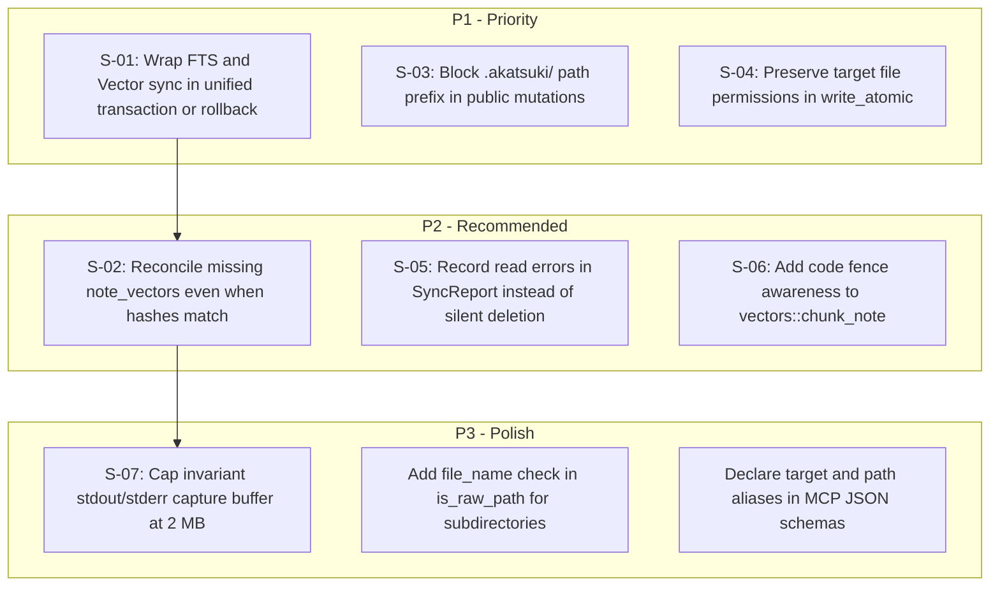

# Master Architectural Audit Report: Akatsuki v0.2.0

**Generated**: 2026-09-28  
**Target Repository**: `fusuyfusuy/akatsuki` (v0.2.0 Native Rust Knowledge Secretariat)  
**Total Rust Substrate**: ~5,880 LOC across 10 modules + 23 integration/regression tests  
**Review Engine**: Antigravity Boundary Review Protocol (4 Horizontal Scopes + 1 Cross-Boundary Seam Auditor)

---

## 1. Executive Scorecard

| Scope ID | Subsystem Name | Health Score | Status | Invariant Breaches | Critical Findings | Primary Driver |
| :--- | :--- | :---: | :---: | :---: | :---: | :--- |
| **`scope_1`** | **Storage & Markdown Engine** | **8.8 / 10** | `MINOR` | 0 | 0 | Prior 3 breaches verified fixed. Residuals: `.akatsuki` internal escape in mutations, file permission stripping in `write_atomic`, `is_raw_path` subdirectory omission. |
| **`scope_2`** | **Indexing, Vectors & Knowledge Graph** | **8.8 / 10** | `MINOR` | 0 | 0 | Prior 3 breaches verified fixed. Residuals: Delayed model setup vector starvation, silent note deletion on read errors, code fence splitting in vector chunker. |
| **`scope_3`** | **Search, Mutations & Invariants** | **9.3 / 10** | `MINOR` | 0 | 0 | Prior 4 breaches verified fixed. Residuals: Unbounded memory buffering on verbose invariants, hybrid score scale disparity, un-reaped child on `try_wait` error. |
| **`scope_4`** | **CLI & MCP Server Gateway** | **9.5 / 10** | `EXEMPLARY` | 0 | 0 | Prior 4 breaches verified fixed. All 20 tools compliant with MCP 2024-11-05. Strict exit code 1 on `--json`, parameter aliasing, scalar coercion in `akatsuki_set`. |
| **`scope_seams`** | **Cross-Boundary Seams** | **8.2 / 10** | `MODERATE` | 1 | 0 | Transaction boundary tear in `src/index/mod.rs`: `tx` commits FTS/entities before `sync_note_vectors`; failure skips `meta_tx`, producing torn text vs vector projection. |
| **OVERALL** | **Full System Architecture** | **8.9 / 10** | **`MINOR`** | **1** | **0** | **Robust, hardened Rust kernel with 21/21 passing regression tests. 1 residual seam tear and targeted hardening candidates.** |

---

## 2. Invariant & Regression Verification (Prior Audit Status)

All 6 Critical Invariant Breaches from the initial audit were verified resolved by the test suite (23/23 tests passing):
1. **[RESOLVED] CLI `--json` Exit Codes**: `std::process::exit(1)` hoisted outside formatting branches in `Commands::Lint` ([`src/cli/mod.rs#L541`](file:///home/fusuyfusuy/Projects/fusuyfusuy/akatsuki/src/cli/mod.rs#L541)) and `Commands::Verify` ([`src/cli/mod.rs#L563`](file:///home/fusuyfusuy/Projects/fusuyfusuy/akatsuki/src/cli/mod.rs#L563)). Asserted in [`tests/regression_tests.rs:182`](file:///home/fusuyfusuy/Projects/fusuyfusuy/akatsuki/tests/regression_tests.rs#L182).
2. **[RESOLVED] Code Fence Isolation in Sections**: `locate_section` maintains fence state for ```` ``` ```` and `~~~` ([`src/storage/mod.rs#L492`](file:///home/fusuyfusuy/Projects/fusuyfusuy/akatsuki/src/storage/mod.rs#L492)). Asserted in [`tests/regression_tests.rs:277`](file:///home/fusuyfusuy/Projects/fusuyfusuy/akatsuki/tests/regression_tests.rs#L277).
3. **[RESOLVED] Relative Path Traversal Underflow**: `contained_path` normalizes relative paths without dropping `..` underflow components ([`src/storage/mod.rs#L197`](file:///home/fusuyfusuy/Projects/fusuyfusuy/akatsuki/src/storage/mod.rs#L197)). Asserted in [`tests/regression_tests.rs:76`](file:///home/fusuyfusuy/Projects/fusuyfusuy/akatsuki/tests/regression_tests.rs#L76).
4. **[RESOLVED] Mutating CTE & SQL Injection Guard**: `execute_sql_query` strips comments and asserts `stmt.readonly()` ([`src/search/mod.rs#L378`](file:///home/fusuyfusuy/Projects/fusuyfusuy/akatsuki/src/search/mod.rs#L378)). Asserted in [`tests/regression_tests.rs:232`](file:///home/fusuyfusuy/Projects/fusuyfusuy/akatsuki/tests/regression_tests.rs#L232).
5. **[RESOLVED] Vector Chunker Frontmatter Isolation**: `chunk_note` falls back to raw body on YAML parse error without aborting reconciliation ([`src/vectors/mod.rs#L83`](file:///home/fusuyfusuy/Projects/fusuyfusuy/akatsuki/src/vectors/mod.rs#L83)). Asserted in [`tests/regression_tests.rs:277`](file:///home/fusuyfusuy/Projects/fusuyfusuy/akatsuki/tests/regression_tests.rs#L277).
6. **[RESOLVED] Invariant Runner Pipe Draining**: Dedicated threads drain stdout and stderr concurrently ([`src/verify/mod.rs#L701`](file:///home/fusuyfusuy/Projects/fusuyfusuy/akatsuki/src/verify/mod.rs#L701)). Asserted in [`tests/regression_tests.rs:89`](file:///home/fusuyfusuy/Projects/fusuyfusuy/akatsuki/tests/regression_tests.rs#L89).

---

## 3. Residual Architectural & Seam Findings

### ⚠️ S-01: Transaction Boundary Tear in Vault Reconcile
- **Scope**: `scope_seams` / `scope_2`
- **Location**: [`src/index/mod.rs:687-699`](file:///home/fusuyfusuy/Projects/fusuyfusuy/akatsuki/src/index/mod.rs#L687-L699)
- **Problem**: `tx.commit()?` flushes FTS5 text updates and entity relations *before* `sync_note_vectors` executes. If vector embedding fails midway (Candle tensor failure, OOM, interruption), `meta_tx` (which records Blake3 file hashes) never executes.
- **Impact**: Text/entity projection reflects new file state, while vector projection reflects old file state. Hybrid RRF search returns torn, mismatched results.
- **Remediation**: Wrap FTS, entities, and vectors in a single SQLite transaction, or rollback `notes_fts` and `entities` if vector synchronization fails.

### ⚠️ S-02: Delayed Model Setup Vector Starvation
- **Scope**: `scope_2`
- **Location**: [`src/index/mod.rs:689-698`](file:///home/fusuyfusuy/Projects/fusuyfusuy/akatsuki/src/index/mod.rs#L689-L698) & [`src/vectors/mod.rs:449-454`](file:///home/fusuyfusuy/Projects/fusuyfusuy/akatsuki/src/vectors/mod.rs#L449-L454)
- **Problem**: When model weights are absent during initial reconcile, `sync_note_vectors` returns `Ok("skipped ...")`. `meta_tx` proceeds to commit Blake3 hashes to `file_meta`. If the user later downloads models via `setup-models`, subsequent `reconcile` runs observe matching hashes and mark files as `unchanged`, never generating embeddings.
- **Impact**: `note_vectors` remains permanently empty post-model-setup until files are manually edited or `.akatsuki/cache.db` is deleted.
- **Remediation**: In `sync_vault_index_with`, check if `note_vectors` contains embeddings for each note, or defer recording `file_meta` when vector generation was skipped.

### ⚠️ S-03: Internal `.akatsuki` Escape in Public Mutation Entry Points
- **Scope**: `scope_1`
- **Location**: [`src/storage/mod.rs:222`](file:///home/fusuyfusuy/Projects/fusuyfusuy/akatsuki/src/storage/mod.rs#L222)
- **Problem**: `contained_path` explicitly whitelists `.akatsuki` and `.akatsuki.lock` so the engine can locate internal files. However, public mutation APIs (`akatsuki_write_note`, `set_property`) also route through `contained_path` without restricting `.akatsuki/`.
- **Impact**: Malicious or accidental mutations can overwrite `.akatsuki/cache.db` or `.akatsuki.lock`.
- **Remediation**: Prohibit paths starting with `.akatsuki/` in `write_note`, `set_note_property`, `replace_section_in_note`, and `append_section_in_note`, keeping the internal whitelist restricted to engine initialization.

### ⚠️ S-04: File Permission Stripping in `write_atomic`
- **Scope**: `scope_1`
- **Location**: [`src/storage/mod.rs:341-350`](file:///home/fusuyfusuy/Projects/fusuyfusuy/akatsuki/src/storage/mod.rs#L341-L350)
- **Problem**: `write_atomic` writes a new temporary file under standard umask (0644) and renames it over the target. Existing target permissions (e.g., 0755 on executable scripts in `60-Scripts` or 0600 on secrets) are lost.
- **Impact**: Executable bits stripped; files become non-executable after mutation.
- **Remediation**: Before renaming, query `fs::metadata(target)?.permissions()` if target exists and copy permissions to `tmp_path` via `fs::set_permissions`.

### ⚠️ S-05: Silent Note Deletion in SQLite Projection on Read Error
- **Scope**: `scope_2`
- **Location**: [`src/index/mod.rs:306, 326-330`](file:///home/fusuyfusuy/Projects/fusuyfusuy/akatsuki/src/index/mod.rs#L306)
- **Problem**: In parallel Rayon scanning, `fs::read_to_string(abs).ok()?` silently drops unreadable files (e.g. transient file lock or permission error). The diff engine interprets missing paths as deleted files and deletes their records from FTS, entities, and vectors.
- **Impact**: Transient read errors permanently wipe indexed data from the projection.
- **Remediation**: Return `Result<ScannedFile>` and record read errors in `SyncReport.parse_errors` rather than dropping the file.

### ⚠️ S-06: Code Fence Splitting in Vector Chunker
- **Scope**: `scope_2`
- **Location**: [`src/vectors/mod.rs:132-153`](file:///home/fusuyfusuy/Projects/fusuyfusuy/akatsuki/src/vectors/mod.rs#L132-L153)
- **Problem**: While `storage::locate_section` was patched to ignore comments inside code fences, `vectors::chunk_note` still uses a raw regex `r"(?m)^(#{1,4})[ \t]+(.+)$"` without code fence tracking.
- **Impact**: Code comments (`# comment`) inside scripts in notes are parsed as section headings in vector embeddings.
- **Remediation**: Align `vectors::chunk_note` with `storage::locate_section` code fence tracking.

### ⚠️ S-07: Unbounded Memory Buffering in Invariant Pipe Draining
- **Scope**: `scope_3`
- **Location**: [`src/verify/mod.rs:701-714`](file:///home/fusuyfusuy/Projects/fusuyfusuy/akatsuki/src/verify/mod.rs#L701-L714)
- **Problem**: `run_invariant` drains child stdout/stderr into `Vec::new()` via `read_to_end` without an upper bound. A runaway subprocess emitting gigabytes can cause an OOM.
- **Impact**: Memory exhaustion during verification of malfunctioning services.
- **Remediation**: Limit captured output to `MAX_INVARIANT_OUTPUT_BYTES` (e.g., 2 MB) using `pipe.take(LIMIT).read_to_end(&mut buf)`.

---

## 4. Prioritized Remediation Roadmap



---

## 5. Executive Approval Gate (MANDATORY STOP)

> [!IMPORTANT]
> **Audit Gate Policy**: This architectural audit is **strictly diagnostic**. In accordance with the Boundary-Review Protocol, **zero code modifications have been made**. Remediations require your explicit direction.

### Options for Operator:
1. **Approve Batch 1 (Transaction & Security Hardening)**: Fix transaction tear between FTS and vectors, block `.akatsuki/` mutation escape, and preserve file permissions in `write_atomic`.
2. **Approve Batch 2 (Vector & Index Robustness)**: Fix vector starvation after `setup-models`, prevent silent deletion on read errors, and add code fence awareness to vector chunking.
3. **Approve Full Remediation (Batches 1 + 2 + 3)**: Execute all 9 prioritized remediations sequentially with automated regression verification.
4. **Custom Selection / Defer**: Select specific findings to fix or defer.
